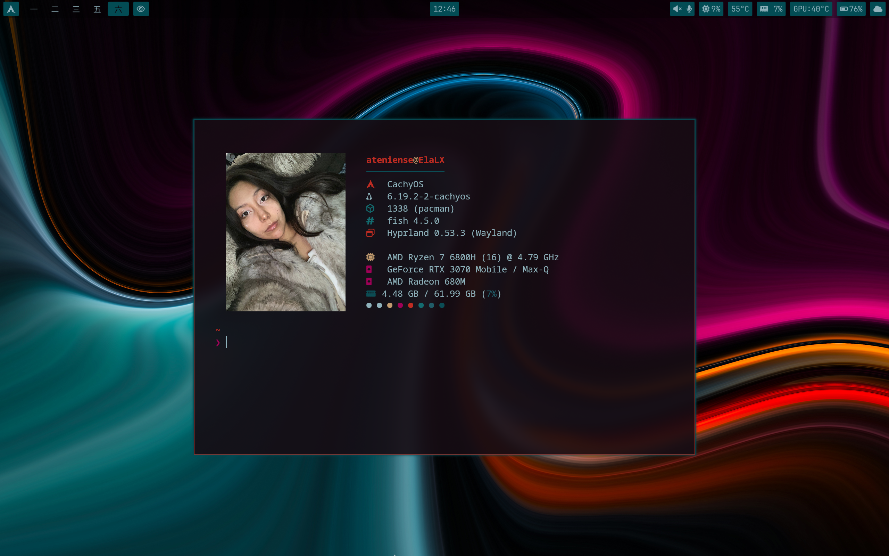
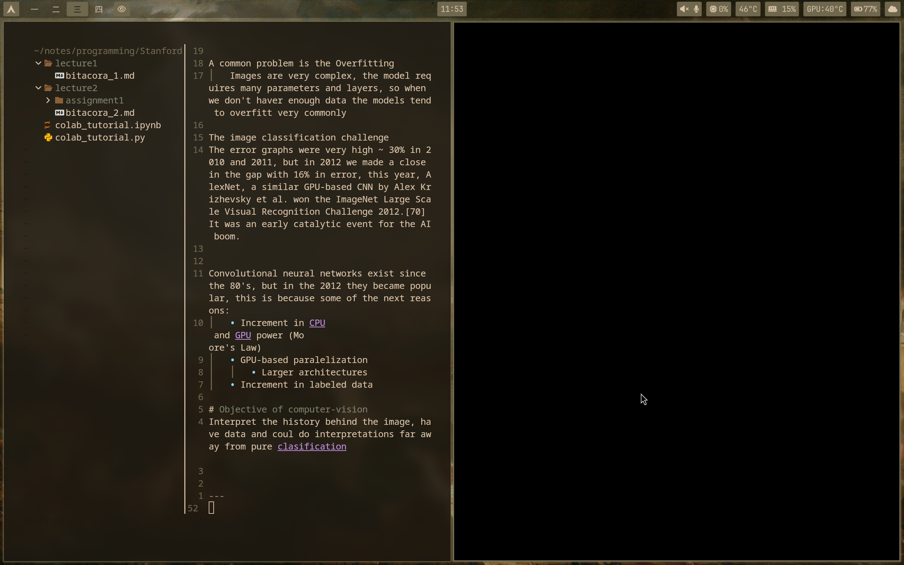
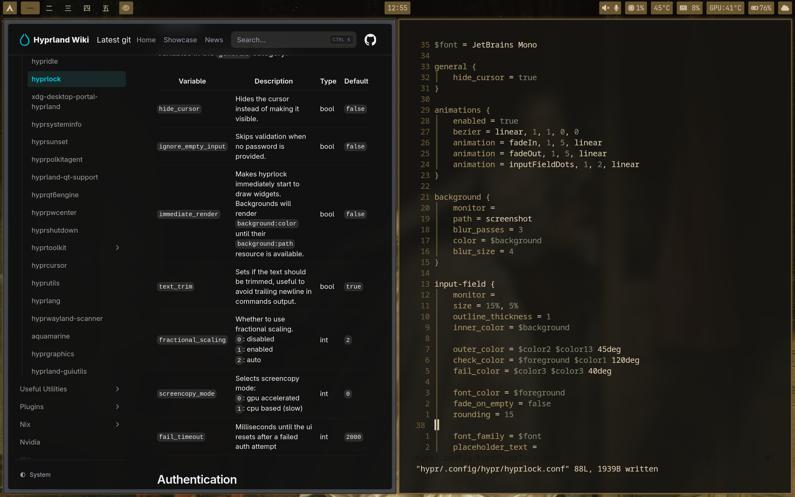
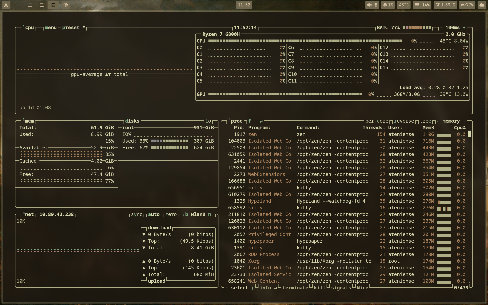
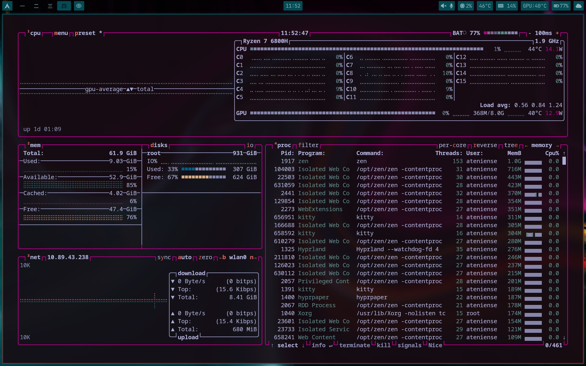
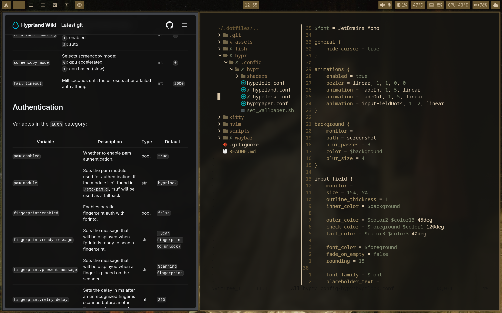
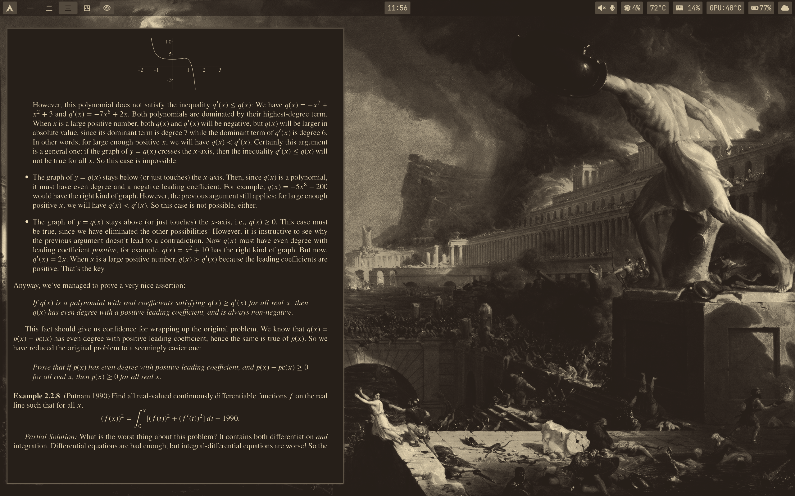
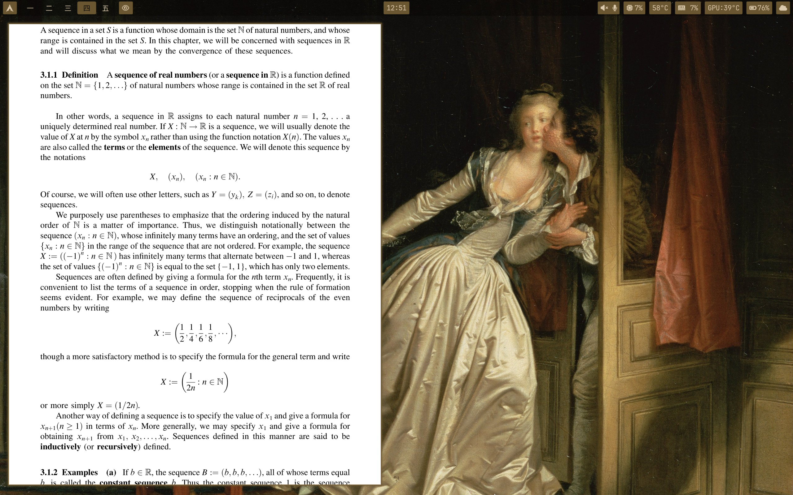
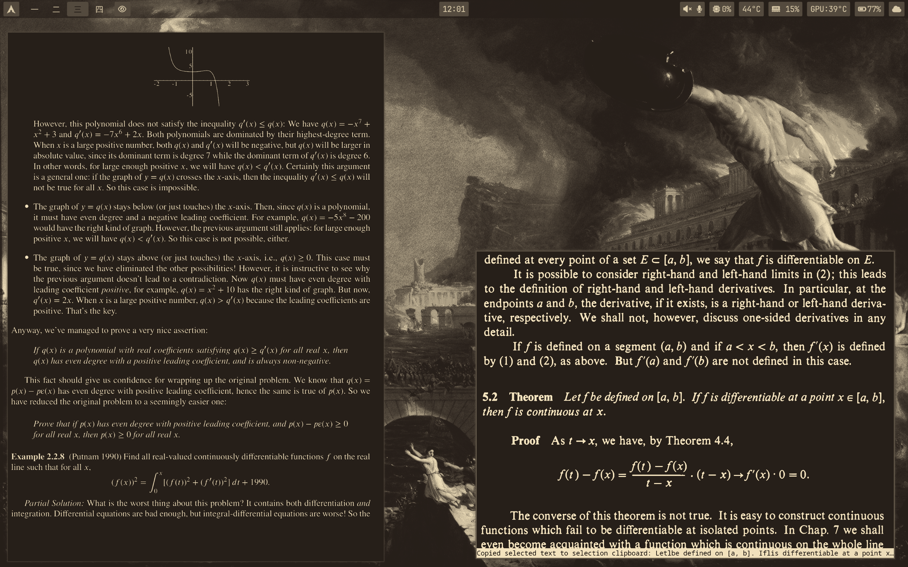

I'm currently working on this... 
# 🏛️ Dotfiles | CachyOS + Hyprland

<div align="center">
  
  <br>
  <p><i>"Civilize the mind, but make savage the body"</i></p>
</div>

## 📜 My Philosophy
A configuration focused on pure performance and adaptive aesthetics, with custom scripts. 

* **CPU:** Ryzen 6800H 
* **GPU:** RTX 3070
* **Base System:** CachyOS (Optimized Arch Linux)
* **WM:** Hyprland (Dwindle Layout)
* **Colors:** Pywal (Dynamic generation based on wallpaper)
* **Typography:** JetBrains Mono Nerd Font

---

## 🖼️ Gallery

### 🎨 The Pywal Ecosystem (Dynamic Colors)
A showcase of how the entire system adapts to the wallpaper color palette instantly. 

<table align="center">
  <tr>
    <td width="33.3%"></td>
    <td width="33.3%"></td>
    <td width="33.3%"></td>
  </tr>
  <tr>
    <td width="33.3%"></td>
    <td width="33.3%"></td>
    <td width="33.3%"></td>
  </tr>
</table>

### ⚙️ System Monitoring & Productivity
Dynamic tiling with Hyprland and beautiful terminal monitoring with `btop`. Notice how the system colors apply uniformly to terminal applications.

<table align="center">
  <tr>
    <td width="50%"></td>
    <td width="50%"></td>
  </tr>
  <tr>
    <td width="50%"></td>
    <td width="50%"></td>
  </tr>
</table>

<div align="center">
  
</div>

### 🌑 Reading Mode (Custom E-Ink Shader)
A key feature is the custom GLSL shader that simulates electronic ink to reduce eye strain. It uses deterministic logic (Bayer matrices) to simulate paper grain and ink bleed. Inspired by the dotfiles from [snes19xx](https://github.com/snes19xx/surface-dots).

<table align="center">
  <tr>
    <th colspan="2">Normal Display vs. E-Ink Shader ON</th>
  </tr>
  <tr>
    <td width="50%"><b>Standard</b><br></td>
    <td width="50%"><b>E-Ink Shader</b><br></td>
  </tr>
  <tr>
    <td width="50%"><b>Standard</b><br></td>
    <td width="50%"><b>E-Ink Shader</b><br></td>
  </tr>
</table>

**E-Ink Details**
<table align="center">
  <tr>
    <td width="50%"></td>
    <td width="50%"></td>
  </tr>
</table>

---

## 🛠️ Tech Stack

| Component | Tool | Notes |
| :--- | :--- | :--- |
| **Shell** | Fish | Configured with `mamba` for Python environments |
| **Bar** | Waybar | Modular JSONC with custom scripts (Nvidia, Pomodoro) |
| **Editor** | Neovim | Lazy.nvim, LSP (Pyright, Lua_ls), Obsidian integration |
| **Launcher** | Wofi/Rofi | Custom launcher scripts |
| **Terminal** | Kitty | GPU accelerated, controlled via socket |
| **Compositor** | Hyprland | `easeOutQuint` animations, `dwindle` layout |

## ✨ Unique Features

* **Hybrid GPU Handling:** Custom scripts to monitor the RTX 3070 (temperature, usage, VRAM) in Waybar, only active when the dGPU is awake.
* **Wallpaper Engine:** `set_wallpaper.sh` script that manages `hyprpaper`, generates `pywal` color schemes, and reloads `waybar`, `kitty`, and `dunst` instantly.
* **Obsidian Neovim:** Zettelkasten workflow integrated directly into the editor.
* **True Reading Mode:** Mathematical implementation of noise and paper grain to simulate real reading conditions.

## 📦 Installation

This repository uses **GNU Stow** to manage symlinks.

```bash
# 1. Clone the repo
git clone [https://github.com/RoshTzsche/dotfiles.git](https://github.com/RoshTzsche/dotfiles.git) ~/dotfiles

# 2. Install dependencies (Partial list)
sudo pacman -S hyprland waybar kitty fish neovim stow pywal

# 3. Deploy configurations
cd ~/dotfiles
stow fish
stow hypr
stow kitty
stow nvim
stow waybar
stow scripts

```

## ⌨️ Keybindings

| Key | Action |
| --- | --- |
| `SUPER + Q` | Terminal (Kitty) |
| `SUPER + E` | File Manager (Dolphin) |
| `SUPER + W` | Change Wallpaper (Random + Pywal) |
| `SUPER + D` | Toggle Reading Mode (E-Ink) |
| `SUPER + F` | Zen Mode |
| `SUPER + L` | Hyprlock |

---

### 🍅 Time Management (Waybar Pomodoro)

Custom Waybar module written in Python with notification integration and visual controls.

<div align="center">

</div>

*by RoshTzsche.*

